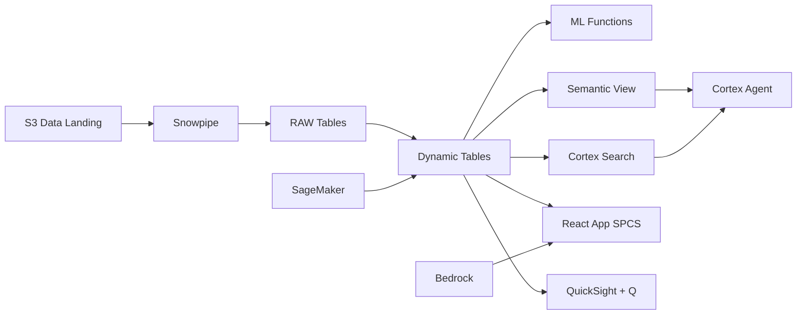

# Nickel Supply Chain Visibility

End-to-end nickel supply chain tracking from mine to battery-grade product for Indonesia's US$33B nickel industry — Dynamic Tables build material flow graphs, Iceberg enables buyer traceability via Athena.

## Architecture

Indonesia controls 22% of global nickel reserves and has banned raw ore exports to force domestic processing into battery-grade products. With 40 mines feeding 12 RKEF and HPAL plants, the VP Supply Chain needs real-time material flow visibility — but grade variance, processing bottlenecks, and long-term buyer contract commitments require predictive intelligence, not monthly reports.



## Snowflake Capabilities

| Capability | Implementation |
|-----------|---------------|
| Dynamic Tables | MATERIAL_BALANCE / PLANT_PERFORMANCE / DELIVERY_COMPLIANCE / GRADE_ANALYTICS |
| ML Functions | ML.FORECAST + ML.ANOMALY_DETECTION |
| Cortex AI | COMPLETE, AI_EXTRACT, SUMMARIZE |
| Cortex Search | 150 documents indexed |
| Cortex Agent | NICKEL_SUPPLY_CHAIN_AGENT |
| Semantic View | NICKEL_SUPPLY_CHAIN_ANALYTICS |
| React App (SPCS) | 5 tabs + DemoGuide |


## AWS Services

| Service | Role in Demo |
|---------|-------------|
| Amazon S3 | Store supply chain documents, certificates, and Iceberg data |
| Apache Iceberg (S3) | Open table format for buyer traceability self-service |
| AWS Glue | ETL for material flow data integration and transformation |
| Amazon SageMaker | Production forecasting and grade prediction models |
| Amazon Bedrock (Claude) | Generate supply chain risk assessments and delivery narratives |
| Amazon QuickSight + Q | Operations dashboard with natural language queries |


## Personas

| Persona | Role | Key Questions |
|---------|------|---------------|
| **Bambang Hartono** | VP Supply Chain & Logistics | "What's the total nickel output this month vs plan?" "Which processing plants are behind schedule?" |
| **Rina Wulandari** | Operations Analyst | "Show me the material balance for HPAL Plant 2." "What's the ore grade distribution from Morowali mines?" |


## Data

| Table | Rows | Description |
|-------|------|-------------|
| MINES | 40 | Active nickel mines across Sulawesi and Maluku with ore grade profiles |
| PROCESSING_PLANTS | 12 | RKEF, HPAL, and smelter plants with capacity and throughput data |
| MATERIAL_FLOW | 80,000 | Ore-to-product material movements with grade tracking |
| PRODUCTION_LOGS | 150,000 | Daily production output by plant, line, and product grade |
| BUYER_CONTRACTS | 200 | Long-term supply agreements with EV OEMs and stainless steel producers |
| SUPPLY_CHAIN_DOCS | 150 | Contracts, SMEL certificates, export permits, and ESG audit reports |


## Build Instructions

### Prerequisites
- Snowflake account with ACCOUNTADMIN access
- Cortex AI enabled (ML Functions, Search, Agent)
- Warehouse: NICKEL_WH (Medium)
- AWS CLI with access (us-west-2)

### Deployment

```bash
snowsql -f snowflake/00_setup.sql
snowsql -f snowflake/01_marketplace_install.sql
snowsql -f snowflake/02_raw_tables.sql
snowsql -f snowflake/03_staging.sql
snowsql -f snowflake/04_dynamic_tables.sql
snowsql -f snowflake/05_search.sql
snowsql -f snowflake/06_ml_models.sql
snowsql -f snowflake/07_semantic_view.sql
snowsql -f snowflake/08_agent.sql
```

### React App (SPCS)
```bash
cd app && npm ci && npm run build
docker build -t aws-indonesia-mining-nickel-supply-chain-app .
docker push bdiqc8sm-default.registry.snowflakecomputing.com/nickel_supply_chain/app/aws_indonesia_mining_nickel_supply_chain/app:latest
```

### Demo Mode
Open the app URL with `?demo=true` for presenter view.

## Build Modes

### Snowflake Only
Run scripts 00-08 (skip AWS-specific integration). Uses:
- **Snowflake Internal Stage + Iceberg Tables** instead of Amazon S3
- **Snowflake-managed Iceberg Tables** instead of Apache Iceberg (S3)
- **Dynamic Tables** instead of AWS Glue
- **ML.FORECAST + ML.ANOMALY_DETECTION** instead of Amazon SageMaker
- **Cortex Complete** instead of Amazon Bedrock (Claude)
- **Snowflake Intelligence (Cortex Analyst)** instead of Amazon QuickSight + Q

### Full AWS + Snowflake
Run all scripts including AWS integration. Deploy QuickSight dashboard from `quicksight/`.

## Business Impact

Industry research and Snowflake customer outcomes:
- **Indonesia produced 1.8 million tonnes of nickel in 2023 — 49% of global mine production** — [USGS](https://www.usgs.gov/centers/national-minerals-information-center)
- **Indonesia's nickel downstream industry attracted US$33B in investment since export ban (2020-2023)** — [BKPM](https://www.bkpm.go.id/)
- **EV battery manufacturers require full mine-to-cathode traceability for ESG compliance** — [IEA](https://www.iea.org/reports/global-ev-outlook-2024)
- **Processing yield optimization in nickel HPAL plants can improve output by 3-5%** — [Wood Mackenzie](https://www.woodmac.com/)


## Key Demo Numbers

- **40 mines** active nickel mines across Sulawesi and Maluku
- **12 plants** RKEF and HPAL processing plants
- **80,000 movements** material flow records tracked
- **96.3% compliance** buyer delivery commitment rate
- **150 documents** contracts and certificates searchable
- **92% of plan** current monthly production output


## License

Apache 2.0 — See [LICENSE](LICENSE) for details.

This is a personal demo project and is not an official Snowflake offering. It comes with no support or warranty.